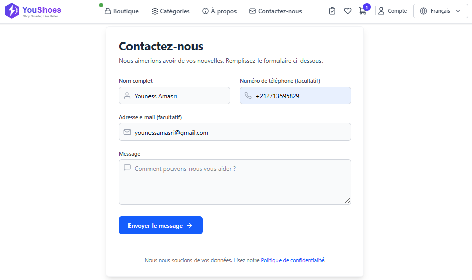
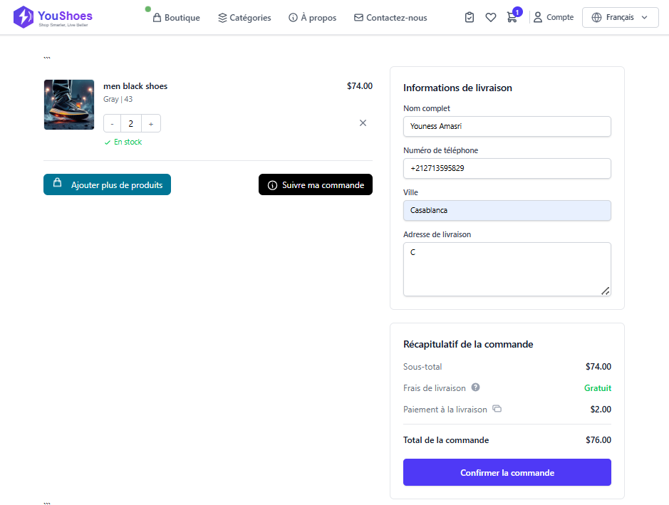
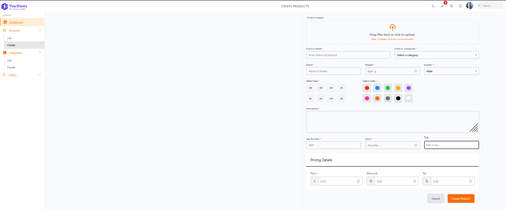

# 🛒 Web App Store

A modern, responsive e-commerce web application built with Laravel, Vue.js, Inertia.js, and Tailwind CSS. It features product listings, shopping cart, wishlist, checkout, multi-language support, and an admin dashboard.

## 🚀 Features

- 🔍 Product filtering, sorting, and searching
- 🛒 Shopping cart (guest-friendly)
- ❤️ Wishlist functionality
- 🌐 Multi-language support (EN, FR, AR)
- 👤 Authentication & authorization
- 📦 Admin dashboard for product & order management
- 📊 Order tracking & feedback
- 🎨 Responsive UI using Tailwind CSS
- ⚡ Fast SPA-like performance via Inertia.js

## 🧰 Tech Stack

| Frontend         | Backend       | Other               |
|------------------|---------------|---------------------|
| Vue.js 3         | Laravel 12    | MySQL               |
| Inertia.js       | PHP 8+        | Git & GitHub        |
| Tailwind CSS     | Sanctum Auth  | Multi-language JSON |

## 📸 Screenshots

### contact Page


### 🛒 Cart Page


### product form


## 📦 Installation

```bash
# 1. Clone the repo
git clone https://github.com/your-username/your-repo.git
cd your-repo

# 2. Install PHP dependencies
composer install

# 3. Install JS dependencies
npm install && npm run dev

# 4. Setup environment
cp .env.example .env
php artisan key:generate

# 6. Serve the app
php artisan serve
